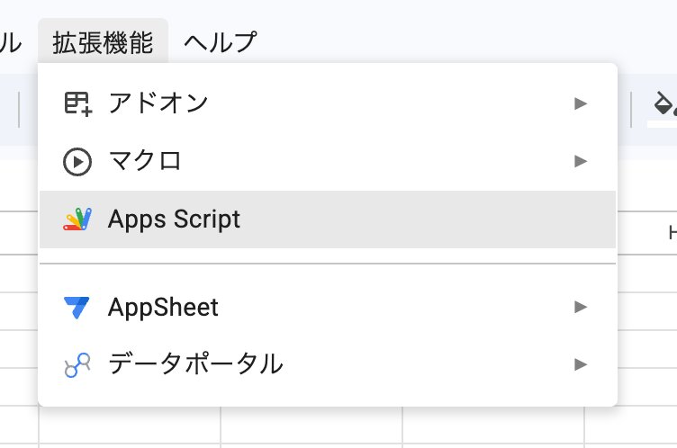
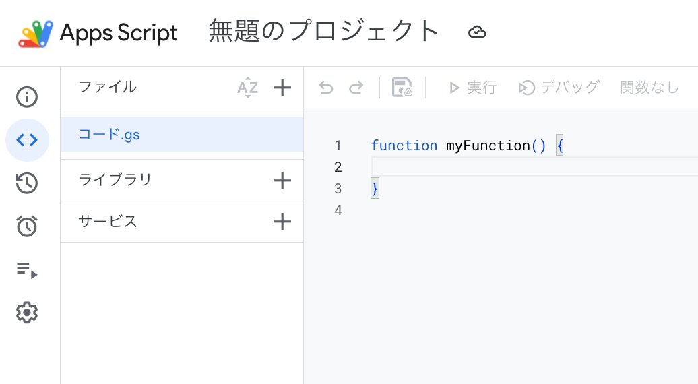
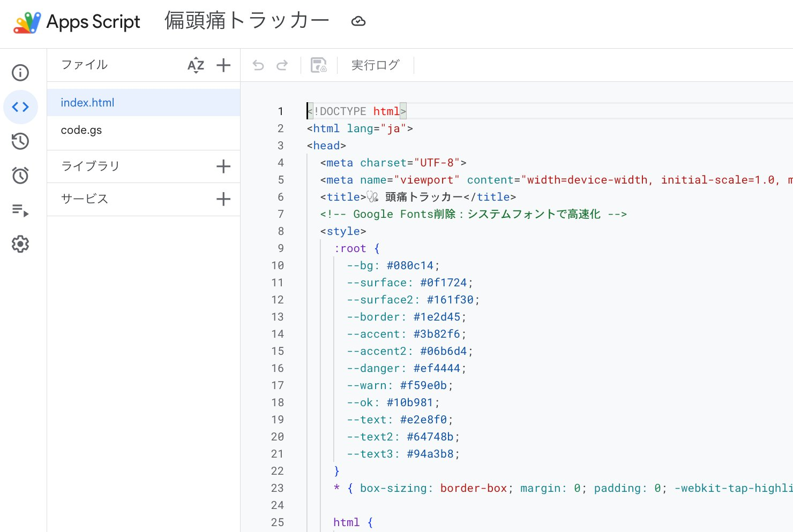
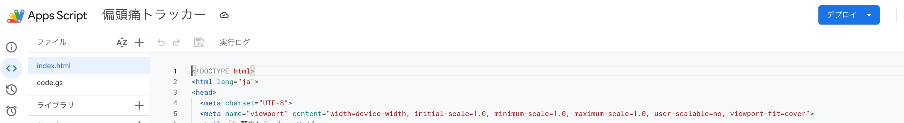
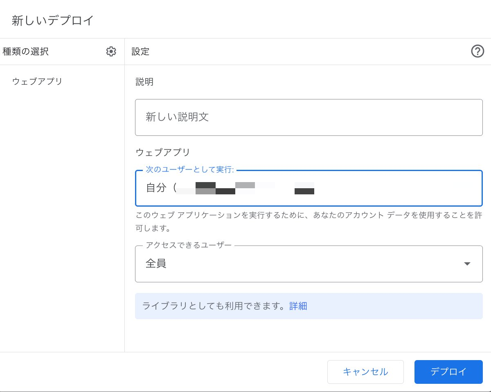
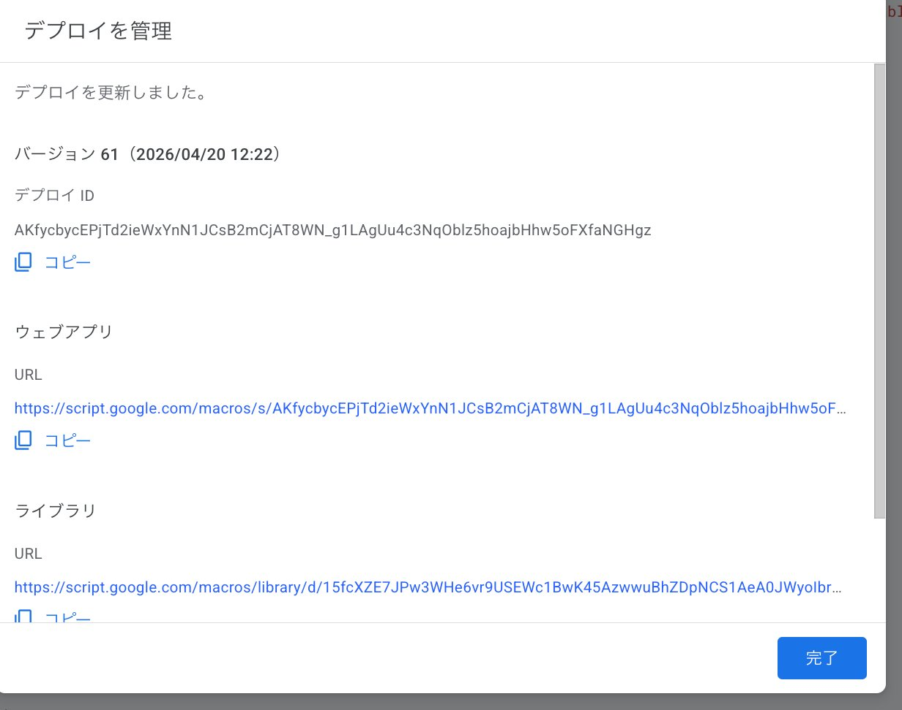
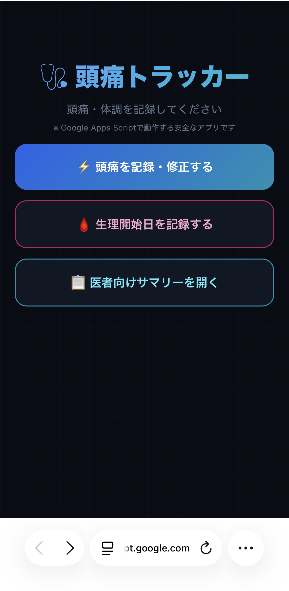
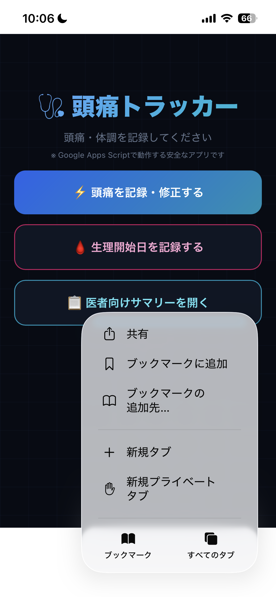
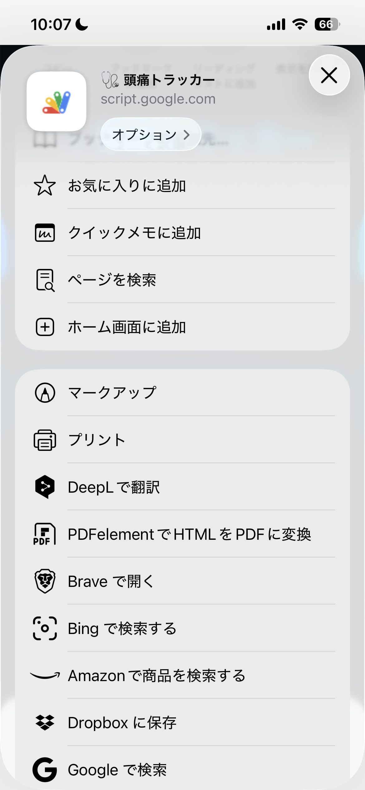
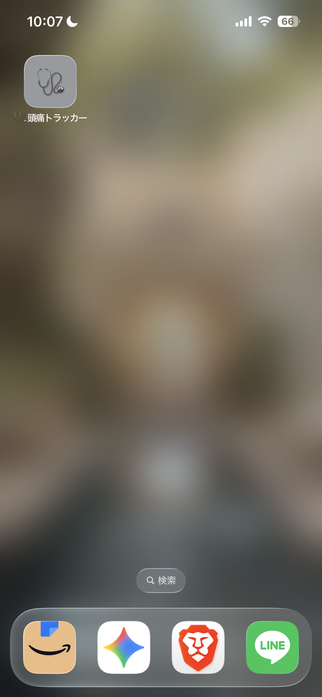

# 📊 Migraine Tracker
[日本語](#japanese) | English

A smartphone-friendly tool for recording and analyzing migraine data with multiple contributing factors.  
Built with Google Apps Script + Open-Meteo API + Google Sheets.

## ✨ Features
- 🌡 **Multi-factor tracking** — Barometric pressure, lunar phase, sleep, and more
- ⚡ **Auto data fetch** — Pressure & lunar data retrieved automatically via API
- 🧙 **7-step Wizard UI** — Minimizes input effort on mobile
- 🔄 **Edit mode** — Update past records anytime
- ✅ **Duplicate check** — Prevents accidental double entries

## 🛠 Tech Stack
- Google Apps Script
- Open-Meteo API (barometric pressure)
- Google Sheets

---

## 🚀 Setup Guide

> ⏱ Takes about 10 minutes. No programming knowledge needed!  
> You'll need: a **Google account** and an **iPhone with Safari**.

---

### Step 1 — Create a New Google Spreadsheet

1. Open [Google Sheets](https://sheets.google.com) in your browser
2. Click **"Blank"** to create a new spreadsheet
3. Give it a name (e.g. `Migraine Tracker`)

---

### Step 2 — Open Apps Script

1. In the top menu, click **"Extensions"**
2. Click **"Apps Script"**

> 💡 **What is Apps Script?**  
> It's a free tool provided by Google that lets you add custom features to Google Sheets. You don't need to understand the code — just paste it in!

---

### Step 3 — Paste the Code

1. You'll see a code editor with some default text like `function myFunction() {}`

2. **Select all of it and delete it**
3. Copy the entire code from [`code.gs`](./code.gs) in this repository
4. Paste it into the editor — it should look like this:

5. Click the **💾 save icon** (or press `Ctrl+S` / `Cmd+S`)

---

### Step 4 — Deploy as a Web App

This step gives you a **personal URL** for your tracker.

1. Click **"Deploy"** in the top-right corner

2. Select **"New deployment"**
3. Click the ⚙️ gear icon next to "Type" and choose **"Web app"**
4. Fill in the settings as shown below:
   - **Execute as**: `Me`
   - **Who has access**: `Anyone`

5. Click **"Deploy"**
6. You may be asked to authorize the app — click **"Authorize access"** and follow the prompts
7. After deployment, you'll see a **Web app URL** — copy it and save it somewhere!

> ⚠️ **Keep this URL private.** Anyone with the link can view and add to your tracker.

---

### Step 5 — Open the Tracker in Safari on iPhone

1. Open the **Safari** browser on your iPhone
2. Paste your **Web app URL** (from Step 4) into the address bar and tap **Go**
3. Confirm the tracker loads correctly

---

### Step 6 — Add to Home Screen

This makes the tracker feel like a native app!

1. Tap the **"..."** button at the bottom right of Safari, then tap **"Share"**

2. Scroll down and tap **"Add to Home Screen"**

3. Give it a name (e.g. `Migraine Tracker`) and tap **"Add"**
4. The icon will now appear on your iPhone home screen 🎉

> 📌 From now on, just tap the icon to open your tracker directly — no need to open Safari and type the URL each time.

---

## 💡 Background
Existing headache apps typically track only one factor (e.g. barometric pressure).  
This tool was designed from a quality engineering perspective — inspired by design of experiments (DoE) — to capture and analyze **multiple contributing factors simultaneously**.

## 📝 Notes
- Developed through AI collaboration (vibe coding)
- Heavily commented code — useful as a learning reference

---

# 📊 偏頭痛トラッカー

偏頭痛の複合要因（気圧・月齢・睡眠など）を同時記録・分析できるスマホ向けツールです。  
Google Apps Script + Open-Meteo API + Google スプレッドシート で動作します。

## ✨ 機能
- 🌡 **複合要因記録** — 気圧・月齢・睡眠・生理周期など複数要因を同時収集
- ⚡ **データ自動取得** — 気圧・月齢データをAPIで自動取得
- 🧙 **7ステップWizard UI** — スマホでの入力負荷を最小化
- 🔄 **修正モード** — 過去のデータをいつでも更新可能
- ✅ **重複チェック** — 二重入力を自動で防止

## 🛠 使用技術
- Google Apps Script
- Open-Meteo API（気圧データ）
- Google スプレッドシート

---

## 🚀 セットアップ手順

> ⏱ 所要時間：約10分。プログラミングの知識は不要です！  
> 必要なもの：**Google アカウント** と **iPhone（Safari）**

---

### ステップ① Google スプレッドシートを新規作成する

1. ブラウザで [Google スプレッドシート](https://sheets.google.com) を開く
2. **「空白」** をクリックして新しいスプレッドシートを作成
3. 名前をつける（例：`偏頭痛トラッカー`）

---

### ステップ② Apps Script を開く

1. 上のメニューから **「拡張機能」** をクリック
2. **「Apps Script」** をクリック

> 💡 **Apps Script ってなに？**  
> Google が提供している無料のツールで、スプレッドシートに独自の機能を追加できます。コードの内容は理解しなくてOK！貼り付けるだけで動きます。

---

### ステップ③ コードを貼り付ける

1. エディタ画面に最初から書いてある文字（`function myFunction() {}` など）を**すべて選択して削除**する

2. このリポジトリの [`code.gs`](./code.gs) にあるコードを**まるごとコピー**する
3. エディタに**貼り付ける**（こんな画面になればOK）

4. 画面上の **💾 保存アイコン** をクリック（または `Ctrl+S` / `Cmd+S`）

---

### ステップ④ ウェブアプリとしてデプロイする（URL を取得する）

このステップで、**あなた専用のURL**が発行されます。

1. 画面右上の **「デプロイ」** をクリック

2. **「新しいデプロイ」** を選択
3. ⚙️ 歯車アイコンをクリックして **「ウェブアプリ」** を選ぶ
4. 以下のように設定する：
   - **次のユーザーとして実行**：`自分`
   - **アクセスできるユーザー**：`全員`

5. **「デプロイ」** をクリック
6. 「承認が必要です」と表示されたら **「アクセスを承認」** をクリックして進む
7. デプロイ完了後に **ウェブアプリのURL** が表示されるのでコピーして保存しておく

> ⚠️ **このURLは他人に教えないようにしましょう。** リンクを知っている人は誰でもあなたのデータにアクセスできます。

---

### ステップ⑤ iPhone の Safari で開く

1. iPhone の **Safari** ブラウザを開く
2. アドレスバーに**ステップ④で取得したウェブアプリのURL**を貼り付けて **「開く」** をタップ
3. トラッカーが正しく表示されることを確認する

---

### ステップ⑥ ホーム画面に追加する

アプリのように使えるようになります！

1. Safari 右下の **「…」ボタン** をタップして **「共有」** を選ぶ

2. **「ホーム画面に追加」** をタップ

3. 名前を入力して（例：`偏頭痛トラッカー`）**「追加」** をタップ
4. ホーム画面にアイコンが追加されます 🎉

> 📌 次回からはホーム画面のアイコンをタップするだけで起動できます！

---

## 💡 開発の背景
既存の頭痛アプリは気圧など単一要因しか追跡できません。  
偏頭痛には複数の要因が絡むと考え、富士ゼロックス時代の**実験計画法・要因効果分析**の経験を活かして自作しました。  
治験ボランティアの経験から生まれた当事者視点の設計が特徴です。

## 📝 開発メモ
- AIとの協働（バイブコーディング）で開発
- コード内にコメントをたっぷり入れてあるので、学習用としても参考になります
